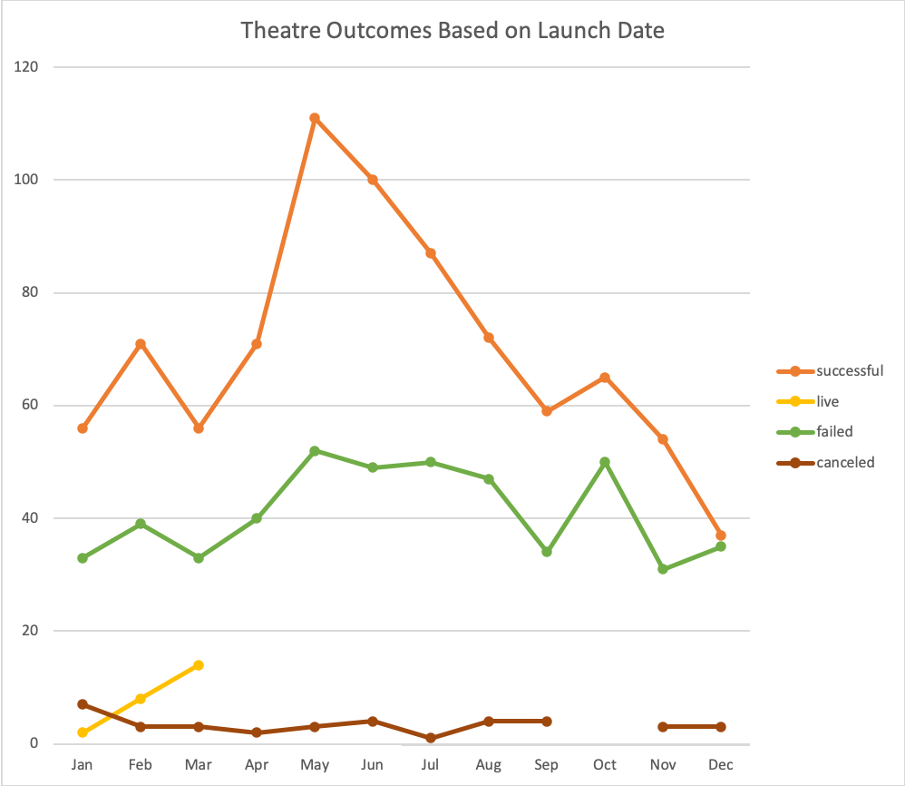
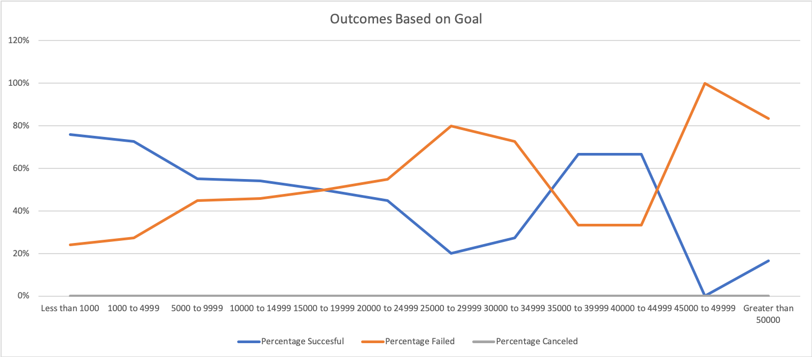

# Module 1 Challenge 

## Overview of the project

The main purpose of the analysis is for understanding how the campaigns fared depending on the Launch date and funding goals. Depending on the results, Louis can figure out what months can be more successful for campaigning and also can estimate the reasonable goal amount that can be set to accomplish a sucessful campaign.

## Analysis and Challenges

From "Outcomes Based on Launch Date" chart,  it's evident that May and June are most successful months for threatre campaign. December is least successful month. Highest number of failed outcomes also seen in May. 

From "Outcomes Based on Goals" chart displayed below, campaign is most successful when the goal amount is less than $1000 and it appears like as the goal amount is increased, there seems to be less chances of campaign becoming successful (except for the range of 35000 - 45000). Eventhough 67% success is seen between 35000 - 45000, it could be dependent on many factors like how long the campain is open for, which month the campain was held and the region where it was held etc. 
Least successful percentage is when the goal amount is raised above 45000.

It was challenging for me to figure out how COUNTIF function can be used for range. HINT video was helpful to figure that out!

## Results

### Conclusion drawn from "Outcomes Based on Launch Date" analysis 

1.  Campaign was most successful in May and June
2.  December was the least successful month for Theatre campaign

### Conclusion about the Outcomes based on Goals

The higher the goal amount is the lesser the chances of campaign becoming successful(especially when the amount is higher than 45000, very low or zero cahnces of reaching the goal)

### Limitations of the dataset

* Lack of previous data for comparision to see how each campaingn fared over the years
* Outliers in the data 
* Lack of gender and age-group information of people interested in each campaign

### Some other possible tables/charts that we could create

We can create 

* Outcomes based on the region
* Outcomes based on how long each campaign is open for
*  Based on the category how many backed out 
*  A chart showing goal vs pledged amounts
	
